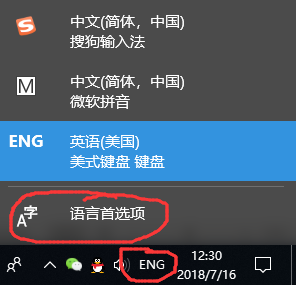
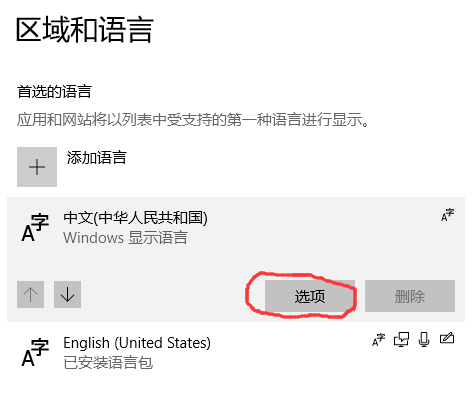
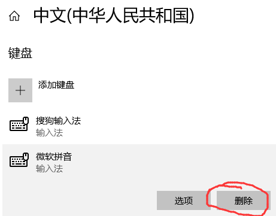
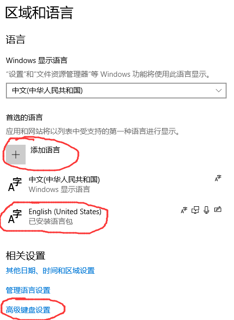
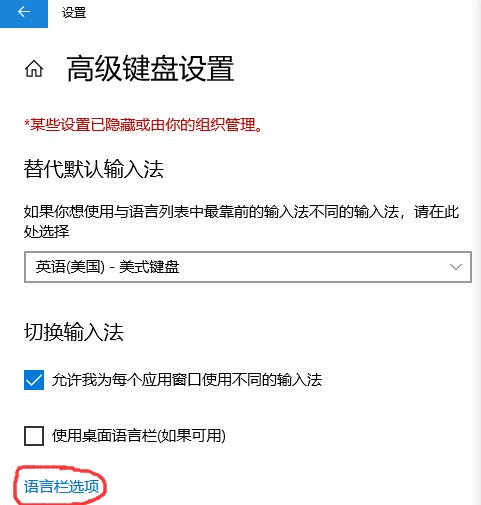

# 设置 Windows 10 中文输入法

以搜狗输入法为例。

## 安装搜狗输入法

在官网下载安装。
	
## 删除微软拼音

左键点击右下角语言栏，选择“`语言首选项`”。

左键点击“`中文`”，然后选择“`选项`”。

选择“`微软拼音`”，然后选择“`删除`”。

## 设置英文键盘为默认输入法

在“`语言首选项`”中，选择“`添加语言`”，添加“`English (United States)`”，可以借助搜索帮助定位。如果已有则跳过这一步。

选择“`高级键盘设置`”。

将“`替代默认输入法`”设置为刚刚添加的“`英语(美国) - 美式键盘`”。

强烈建议勾选“`允许我为每个应用窗口使用不同的输入法`”。
	
## 更改切换语言快捷键

在“`语言栏选项`”中更改。

