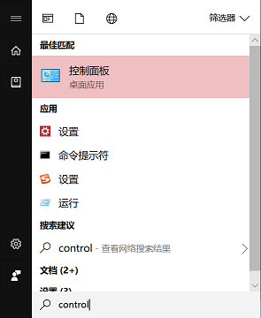
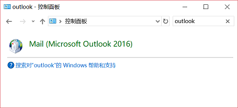

# 重置 Outlook

参考来源：[How to reset outlook 2016 to default](http://www.dptechgroup.com/microsoft-outlook-email/how-to-reset-outlook-2016-to-default/)

快速清除当前 Outlook 所有账户，回归到初始配置状态。

## 关闭 Outlook

## 打开控制面板

在开始菜单中搜索`控制面板`（英文系统搜 `Control Panel`），打开。

## 打开 Outlook 设置

在控制面板中打开 `Main (Microsoft Outlook 2016)`，可通过搜索帮助查找。

## 删除配置文件

打开`显示配置文件`，删除所有配置文件，保存退出。

## 重新配置 Outlook

- 重启 Outlook

- 根据提示新建配置文件

- 添加邮件账户

## 清理邮箱缓存文件

见[清理 Outlook 缓存](clean-cache.md)。
