# 刷机

> 作者：阿小庆<br>
> 链接：[https://www.jianshu.com/p/bb4587014349](https://www.jianshu.com/p/bb4587014349)<br>
> 來源：简书<br>
> 简书著作权归作者所有，任何形式的转载都请联系作者获得授权并注明出处。

TX2 出厂时，已经自带了 Ubuntu 16.04 系统，可以直接启动。但一般我们会选择刷机，目的是更新到最新的 JetPack L4T，并自动安装最新的驱动、CUDA Toolkit、cuDNN、TensorRT。

刷机注意以下几点：
- 开发板刷机过程全程联网。
- 除了Jetson TX2之外，您还需要另一台带有 Intel 或 AMD x86 处理器的台式机或笔记本电脑。~~（所以自己要是 Win 电脑，要安装 VMware 虚拟机，并在虚拟机上安装 Ubuntu 的操作系统，我安装的是Ubuntu -16.04.3 64 位）~~ `实测 Win10 无法加载 APX 驱动，无法使用 VM 虚拟机。`
- 这些类型的机器通常被称为 PC 的个人电脑。该计算机被称为烧录过程的主机。
- JetPack 是一个 x86 二进制文件，不能在基于 ARM 的机器上运行。

先推荐一个国外刷机技术视频：[https://v.qq.com/x/page/b0515967lbr.html](https://v.qq.com/x/page/b0515967lbr.html)

这个视频挺好，虽然是 JetPack 3.0 刷机，但步骤一模一样。跟着他的步骤刷机就可以，不过有些地方可能不够详细，可以自己先看一遍，有个大致印象。

# 从官网下载 JetPack 3.1

下载地址为：[https://developer.nvidia.com/embedded/jetpack](https://developer.nvidia.com/embedded/jetpack)，理论上此处下载需要 NVIDIA 的帐号。可以用 QQ 账号快速登录。

~~为了下载方便，我给出 JetPack3.0、JetPack3.1 百度云链接：
链接：[https://pan.baidu.com/s/1kW5DgEF](https://pan.baidu.com/s/1kW5DgEF) 密码：eu4q~~ `还是从官网下吧`

# 安装 JetPack 3.1

- 现在把刚下载的软件包上传的虚拟机中 Ubuntu 主机中，可以通过共享文件夹的形式，将 JetPack 3.1 从 Win 电脑 copy 到 VMware 虚拟机中的 Ubuntu，这个方法大家可以网上搜下，这里不做赘述。

- 然后在虚拟机上，终端定位到 Jetpack 3.1 所在文件夹。

- 更改执行权限：`chmod +x ./JetPack-L4T-3.1-linux-x64.run`

- 执行安装：`sudo ./JetPack-L4T-3.1-linux-x64.run`

- 然后进入了软件界面


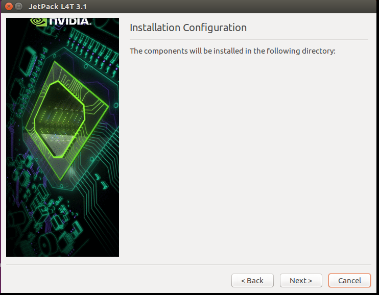

- 选择板子

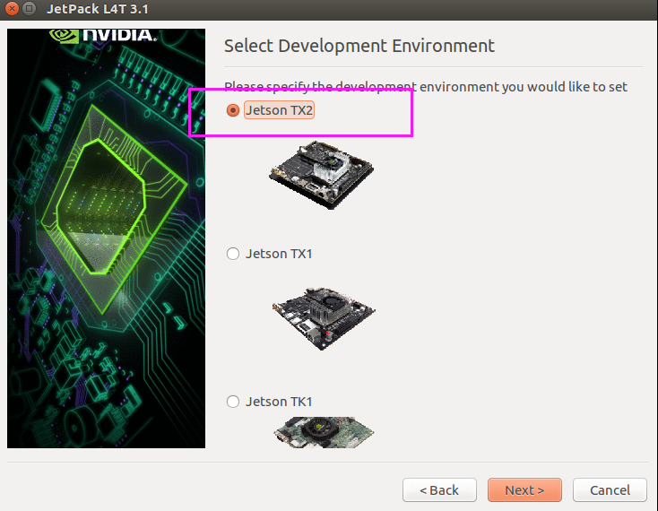
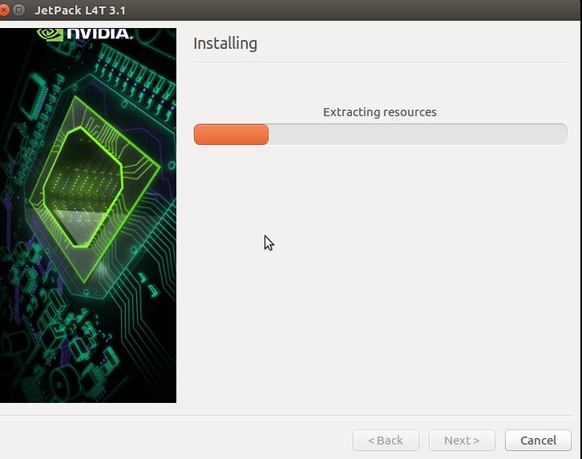

- 随后进入了 Component Manager 界面。此过程容易失败，多尝试几次。如图所示：

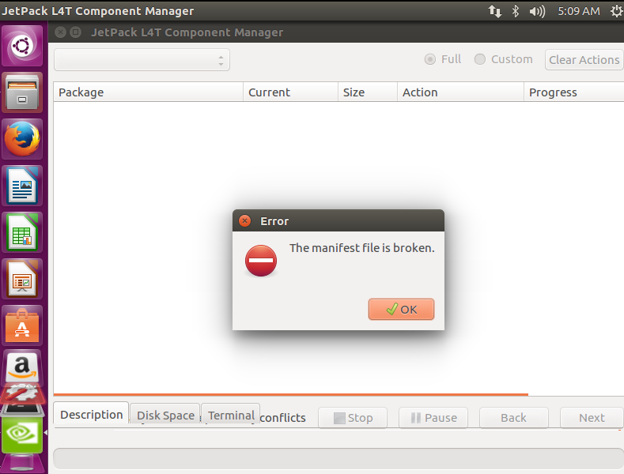

- 成功后，就要下载各种包了

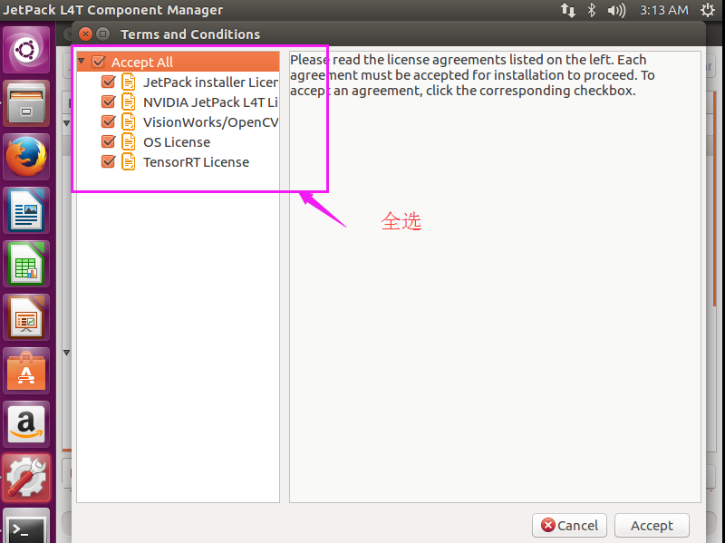

- 点击，进入下一步。`检查下是否选择上了 CUDA Toolkit 和 OpenCV for Tegra，这两个包一定要装。`下载过程可能持续 1-2 个小时，视网速而定。

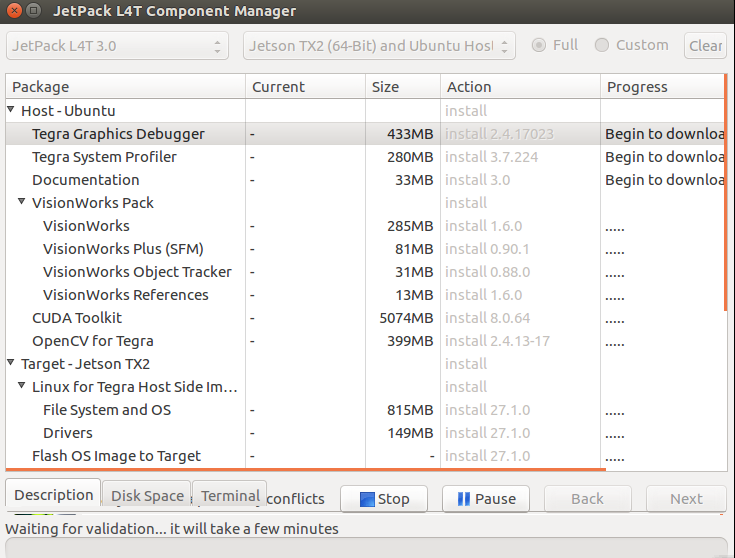

- 漫长的等待。下载过程会持续 1-2 个小时，如果期间出现错误，就返回上一步操作，然后再下一步，他会接着之前下载的继续下载。

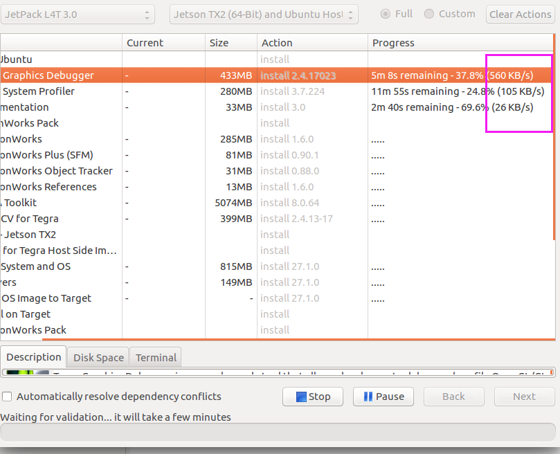

- 放在实验室一晚上后......

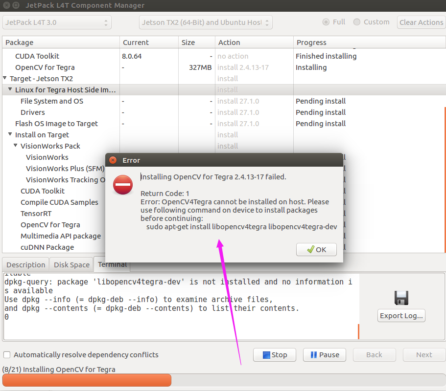

- 如果遇到上面错误：`ctrl+ Alt + T` 另打开一个命令窗口，运行下面语句，就可以了。
  
``` bash
sudo apt-get install libopencv4tegra libopencv4tegra-dev
```

- 接下来，Next 下一步

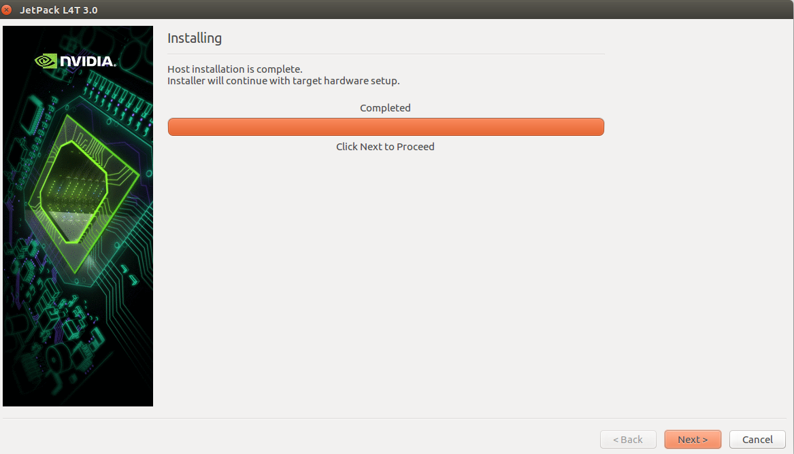

- 这一步，选择第一种连接方式（首先有两个网线，分别插到自己电脑上和 Jetson TX2 上，然后都连接到路由器上），如下图

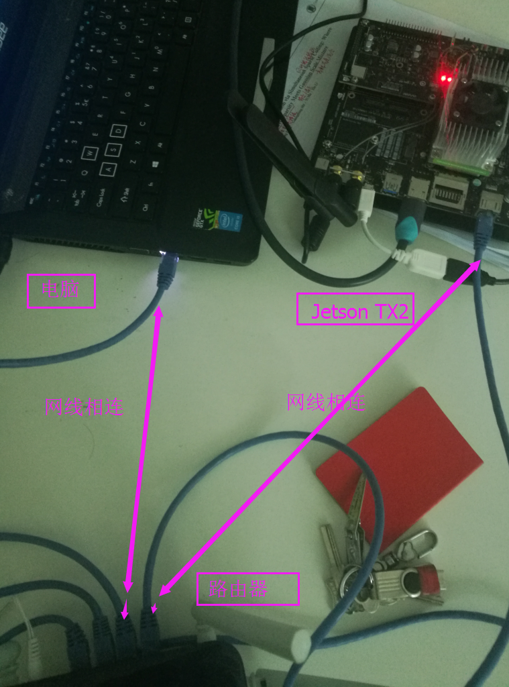

- 开发板刷机过程中需要全程联网，那么官方推荐的做法就是把电脑与开发板用网线连在同一个路由器下。那么在弹出的 network layout 配置中选择路由连接；在 network interface 中选择以太网端口，不认识的话就用默认选项。我在同个人电脑和 Jetson TX2 都连接在同一个 wifi 下试过，没有成功。

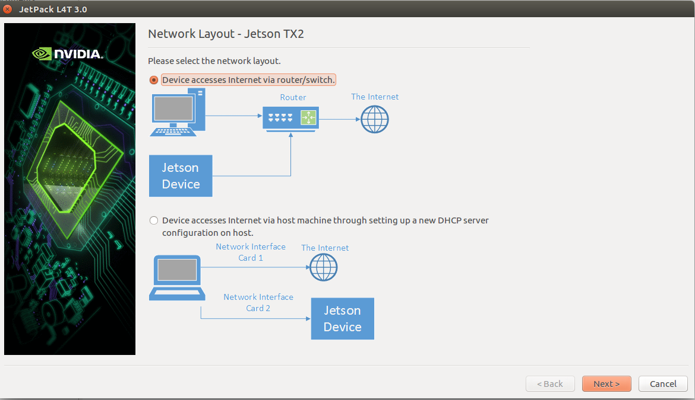
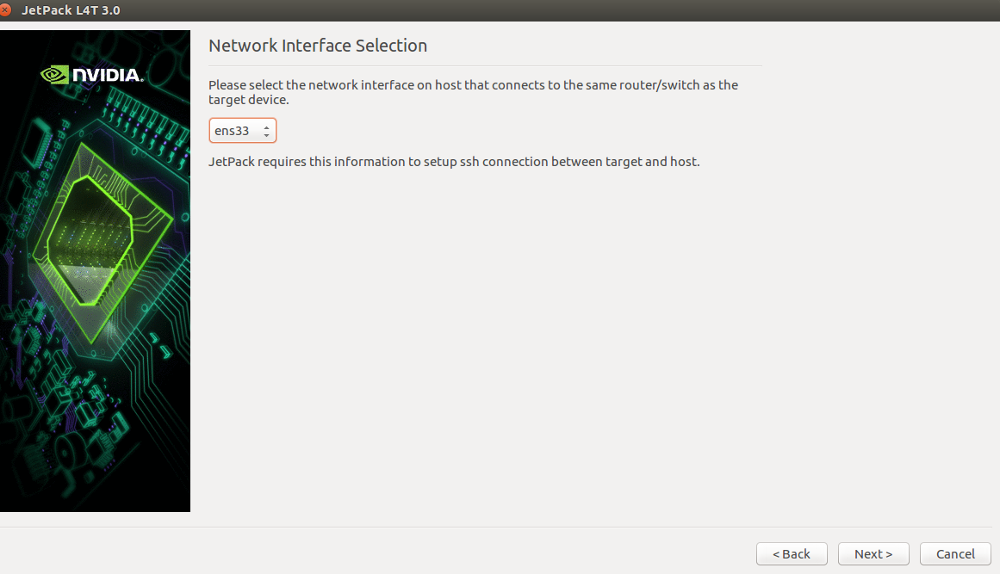

- 点击 Next

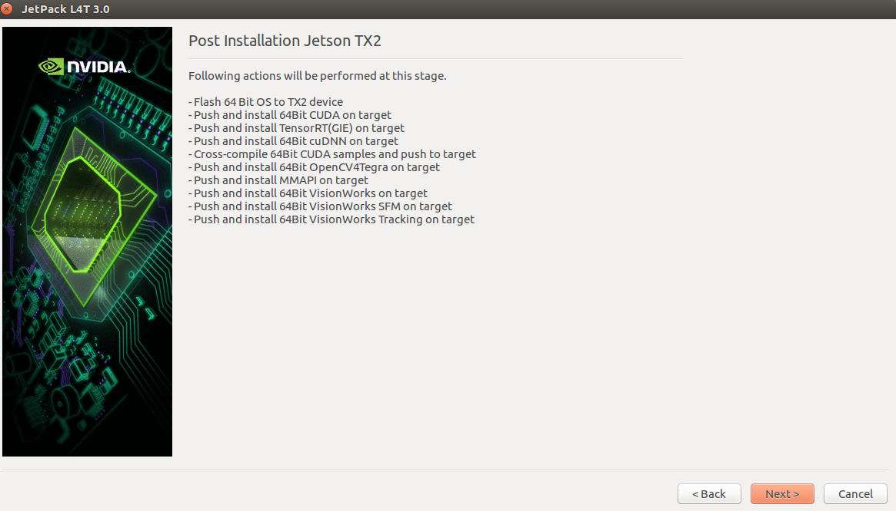

- 弹出一个窗口

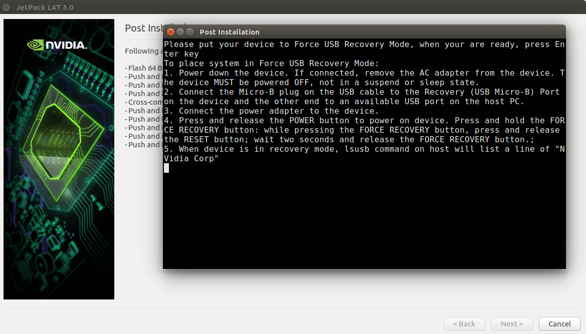

# 开发板连接到电脑，开始刷机

1. 断开电源，保证开发板处于断电关机状态

2. 用网线连到路由器上，也可插上鼠标键盘

3. 用 Micro USB 线把开发板连到电脑上（类似于安卓手机连电脑）

4. 接通 AC 电源，按下 power 键，开机

5. ~~刚一开机~~ `实测开机后任何时候操作都可以`，就长按 Recovery 键不松开，然后点按一下 Reset 键（Down and Up），过 2s 以后才松开 Recovery 键，此时开发板处于强制恢复模式

6. 完成以上步骤后，我们还要检查开发板有没有和电脑正确连接，按 `Ctrl + Alt + T` 另打开一个终端输入 `lsusb` 命令，可以看到一些列表，只要发现其中有 Nvidia Corp 就说明连接正确。

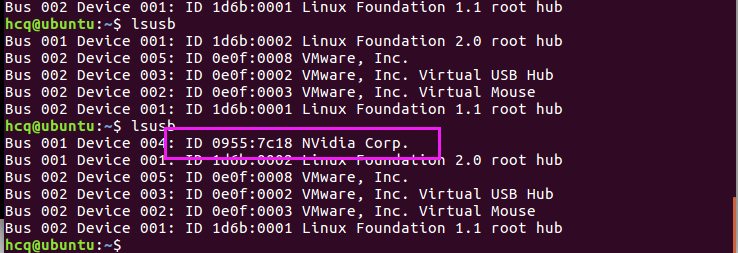

7. 以上步骤确认无误后，在刚才 post installation 界面中敲一下 enter，就开始了刷机过程，持续大概半个小时，你可以喝杯咖啡。显示下面界面就代表完成安装了。`作者给的这个图好模糊啊，一开始我还以为我*多了`

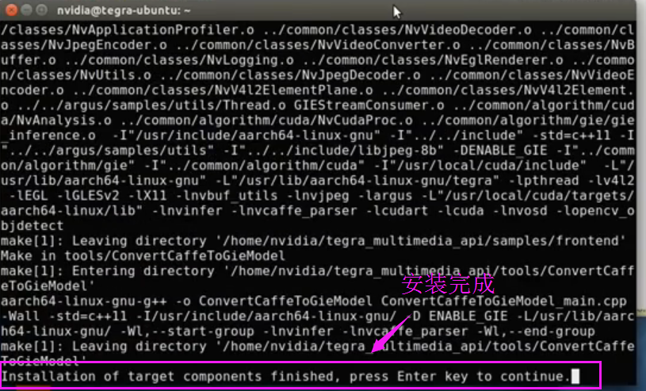

8. 下面是安装确认界面，确认无误后，点击“Next”即可。Post Installation 完成之后，显示删除下载文件，可以先不勾选删除下载文件。

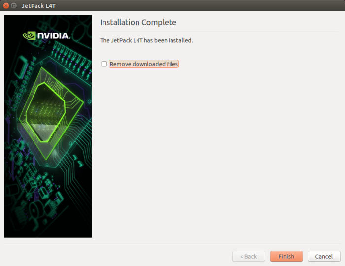

好了，到这就算刷机完成了。

# 运行视频目标检测 Demo

刷机成功后，重启 TX2，连接键盘鼠标显示器，就可以跑 Demo 了。

1. 进入 tegra_multimedia_api/samples/backend 中

``` bash
cd home/nvidia/tegra_multimedia_api/samples/backend
```

2. 执行下面命令

``` bash
./backend 1 ../../data/Video/sample_outdoor_car_1080p_10fps.h264 H264 --trt-deployfile ../../data/Model/GoogleNet_one_class/GoogleNet_modified_oneClass_halfHD.prototxt --trt-modelfile ../../data/Model/GoogleNet_one_class/GoogleNet_modified_oneClass_halfHD.caffemodel --trt-forcefp32 0 --trt-proc-interval 1 -fps 10
```

就可以看到下面例子了！

自此就完成了，踩得坑真是都快残了，醉了！好了，现在就好好和 Jetson TX2 玩耍吧！！！

# 可能遇到的问题

## Error: JetPack must be run on x86_64 HOST platform. Detected i686 platform

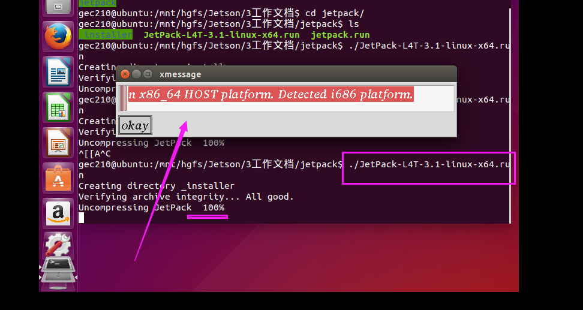

上述问题是因为虚拟机安装的 Ubuntu14.04 不是 64 位支持的，卸载了 Ubuntu14.04，我又装了 Ubuntu16.04，可以了！

下面是我用的 ubuntu-16.04下载链接：[ubuntu-16.04](https://www.ubuntu.com/download/desktop/thank-you?country=CN&version=16.04.3&architecture=amd64)

## 在下面代码地方卡住一直不动

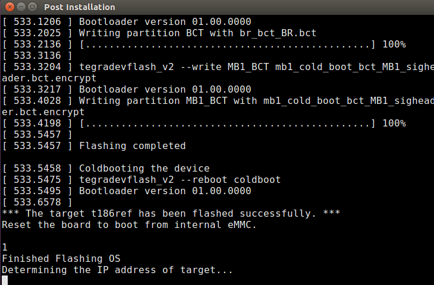

主要原因是虚拟机的网络适配器模式选择了 NAT 模式共享主机 IP 地址，一定要改为桥接模式，复制物理网络连接模式，如下图：

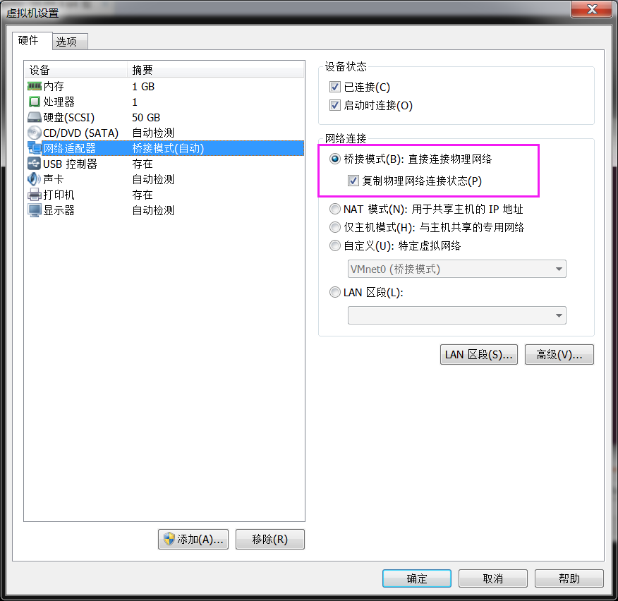

点击`虚拟机`-->`设置`，将网络适配器中的网络连接改为桥接模式，并勾选复制物理网络连接状态。

如果修改之后桥接模式不能联网，那就试试下面方法：VM 虚拟机桥接模式无法联网解决办法。再重新执行一遍就好了！

写于2018/06

Install TensorFlow on the NVIDIA Jetson TX2 Development Kit

专门讲解如何为NVIDIA Jetson TX2安装Tensorflow，看下面链接：[jetsonhacks/installTensorFlowTX2](https://github.com/jetsonhacks/installTensorFlowTX2)
